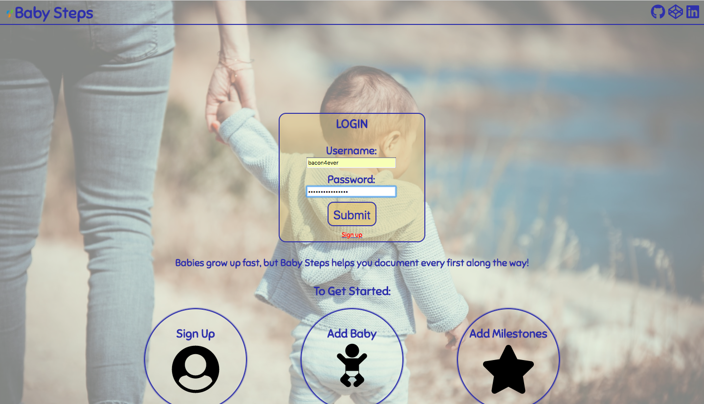
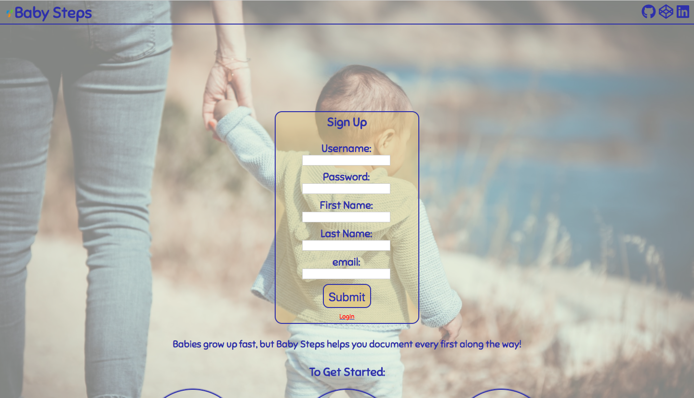
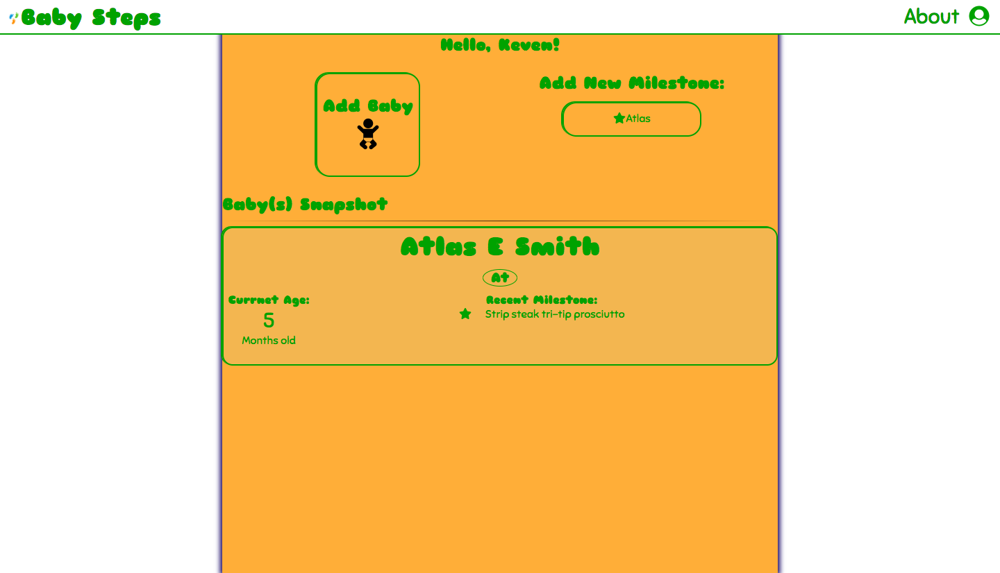
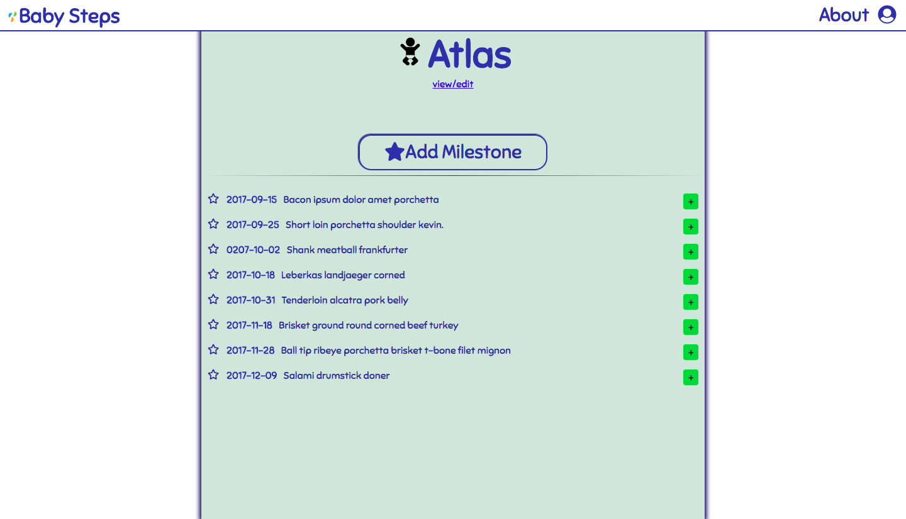

<h1>Baby Steps</h1>

Babies experience so much exciting growth very quickly. Baby Steps allows the user to log these different milestones. Users can log all of the special moments each of their children has. 

<h2>Screen Shots</h2>

<h3>Sign In/Sign Up</h3>

<h3>Dashboard</h3>

<h3>Milestones</h3>

<h2>DEMO</h2>

<a href="https://babysteps-milestone.herokuapp.com/">Live Demo</a>

<h2>Technology</h2>

Front End
<ul>
	<li>html</li>
	<li>css</li>
	<li>javascript</li>
	<li>jQuery</li>
	<li>AJAX</li>
</ul>
Back End
<ul>
	<li>node.js</li>
	<li>express</li>
	<li>passport</li>
	<li>chai</li>
	<li>jsonwebtoken</li>
</ul>

<h2>Credit</h2>

Index page background image by Guillaume de Germain on Unsplash