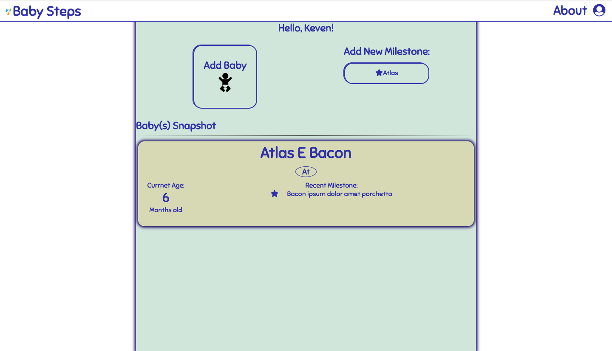

<h1>Babay Steps</h1>

During the first year of a babies life they can go through a number a different milestones, achivements, and firsts. This app allows the user to log these different milestones. A new user is able to sign up, add there baby, and add their milestone.  Milestones can be edited and deleted. 

<h2>Screen Shots</h2>

<h3>Sign In/Sign Up</h3>

<h3>Dashboard</h3>

<h3>Milestones</h3>

<h2>DEMO</h2>

<a href="https://babysteps-milestone.herokuapp.com/">Live Demo</a>

<h2>Technology</h2>

Front End
<ul>
	<li>html</li>
	<li>css</li>
	<li>javascript</li>
	<li>jQuery</li>
	<li>AJAX</li>
</ul>
Back End
<ul>
	<li>node.js</li>
	<li>express</li>
	<li>passport</li>
	<li>chai</li>
	<li>jsonwebtoken</li>
</ul>