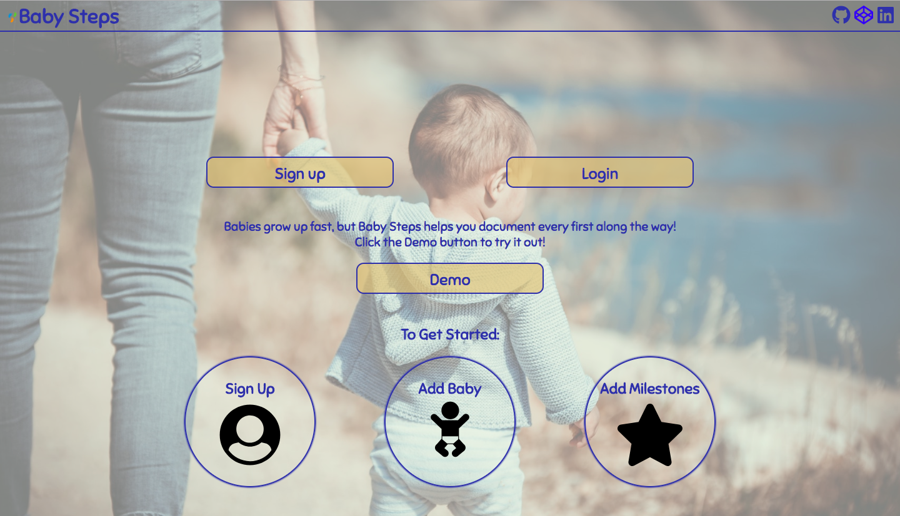

<h1>Baby Steps</h1>

Babies experience so much exciting growth very quickly. Baby Steps allows the user to log these different milestones. Users can log all of the special moments each of their children has. 

<h2>Screen Shots</h2>

<h3>Landing Page</h3>

<h3>Sign In/Sign Up</h3>

<h3>Dashboard</h3>

<h3>Milestones</h3>

<h2>DEMO</h2>

<a href="https://babysteps-milestone.herokuapp.com/" target="_blank">
	Live Demo
</a>
<h3>DEMO logIn</h3>

Username: bacon4ever

Password: notagoodpassword

<h2>Technology</h2>

Front End
<ul>
	<li>html</li>
	<li>css</li>
	<li>javascript</li>
	<li>jQuery</li>
	<li>AJAX</li>
</ul>
Back End
<ul>
	<li>node.js</li>
	<li>express</li>
	<li>mongoDB</li>
	<li>mongoose</li>
	<li>passport</li>
	<li>chai</li>
	<li>jsonwebtoken</li>
</ul>
Third Party Resources 
<ul>
	<li><a href="https://mlab.com/welcome/" target="_blank">mlab</a></li>
	<li><a href="https://travis-ci.org/" target="_blank">Travis CI</a></li>
	<li><a href="https://www.heroku.com/home" target="_blank">heroku</a></li>
</ul>

<h2>Credit</h2>

Index page background image by Guillaume de Germain on Unsplash